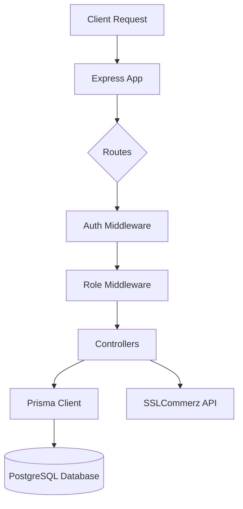

# 🏗️ Event Circle Backend

The backend for **Event Circle** is a high-performance, domain-driven RESTful API built with **Express.js**, **TypeScript**, and **Prisma**. It serves as the core engine for user authentication, event lifecycle management, and secure payment processing.

---

## 🛠️ Technology Stack

- **Runtime**: Node.js (v18+)
- **Language**: TypeScript
- **Framework**: Express.js (v5.2+)
- **ORM**: Prisma (v7.7+)
- **Database**: PostgreSQL (Neon/Cloud or Local)
- **Authentication**: JWT (JSON Web Tokens) & Bcrypt (Password Hashing)
- **Validation**: Zod
- **Payment Gateway**: SSLCommerz (LTS)

---

## 📋 Architecture Overview

The backend follows a modular, layer-based architecture for scalability and maintainability:



- **Modules**: Logic is divided into `auth`, `admin`, `user`, and `ticket` modules.
- **Middlewares**: Centralized auth verification and role-based access control.
- **Lib**: Reusable instances like the Prisma client.

---

## 📡 API Reference

### 🔐 Authentication
| Method | Endpoint | Description | Access |
| :--- | :--- | :--- | :--- |
| POST | `/auth/register` | Register a new user account | Public |
| POST | `/auth/login` | Login and receive JWT access token | Public |
| GET | `/auth/user-profile`| Fetch details of authenticated user | Private |

### 👑 Admin Operations
| Method | Endpoint | Description | Access |
| :--- | :--- | :--- | :--- |
| GET | `/api/admin/get-all-users` | Retrieve all registered users | ADMIN |
| POST | `/api/admin/create-event` | Create a new event | ADMIN |
| PUT | `/api/admin/update-event/:id`| Update an existing event | ADMIN |
| DELETE| `/api/admin/delete-event/:id`| Delete an event by ID | ADMIN |
| GET | `/api/all-tickets` | View all successful bookings | ADMIN |

### 👤 User & Event Features
| Method | Endpoint | Description | Access |
| :--- | :--- | :--- | :--- |
| GET | `/api/events` | List all available events | Public |
| GET | `/api/events/:id` | Get single event details | Public |
| GET | `/api/my-ticket/:email` | Get tickets for a specific user | USER/ADMIN |
| POST | `/api/review` | Submit a rating/review for an event| USER |

---

## 💳 Payment Flow (SSLCommerz)

1. **Initiation**: User clicks "Buy Ticket" -> Backend generates a unique `tran_id` and registers a `PENDING` booking.
2. **Redirection**: Backend calls SSLCommerz `init` and returns a `GatewayPageURL` to the client.
3. **Transaction**: User finishes payment on SSLCommerz portal.
4. **Validation**: SSLCommerz hits the `/api/success-payment/:id` endpoint.
5. **Completion**: Backend updates booking status to `SUCCESS` and redirects user back to the dashboard.

---

## ⚙️ Prerequisites & Setup

### 1. Environment Variables
Create a `.env` file in the `event-circle-backend` root:

```env
PORT=4001
DATABASE_URL="your_postgresql_url"
JWT_SECRET="your_secure_random_key"
store_id_SSLcommerz="your_id"
store_passwd_SSLcommerz="your_password"
FRONTEND_URL="http://localhost:3000"
BACKEND_URL="http://localhost:4001"
```

### 2. Installation
```bash
npm install
```

### 3. Database Initialization
```bash
npx prisma generate
npx prisma migrate dev --name init
```

### 4. Run Development Server
```bash
npm run dev
```

---

## 📦 Scripts
- `npm run dev`: Start server with `tsx watch`.
- `npm run build`: Compile TypeScript to JavaScript.
- `npm run start`: Run the compiled production server.
- `npm run lint`: Run ESLint checks.
